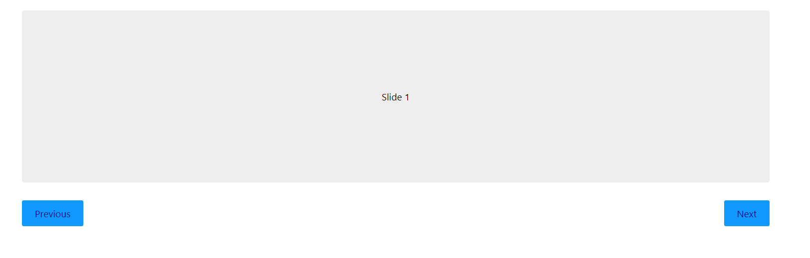

# vue3-slide

<h1 align="center">
    
</h1>

Slide feito no React refatorado para o Vue 3 para treinar os conhecimentos aprendidos.
Toda a reatividade foi reescrita para que o código feito em React funcionasse no Vue3.

## 🧪 Technologies

This project was developed using the following technologies:

- [Vue 3](https://v3.vuejs.org/)
- [Vite](https://vitejs.dev/)

## 🚀 Getting started

Clone the project and access the folder.

```bash
$ git clone https://github.com/bfukumori/vue3-slide.git
$ cd vue3-slide
```

Follow the steps below:
```bash
# Install the dependencies
$ npm i

# Start the project
$ npm run dev
```
The app will be available for access on your browser at http://localhost:3000
